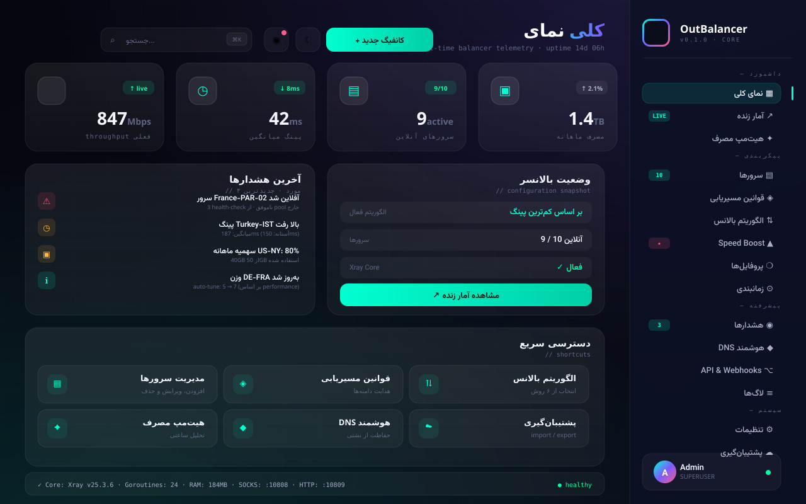
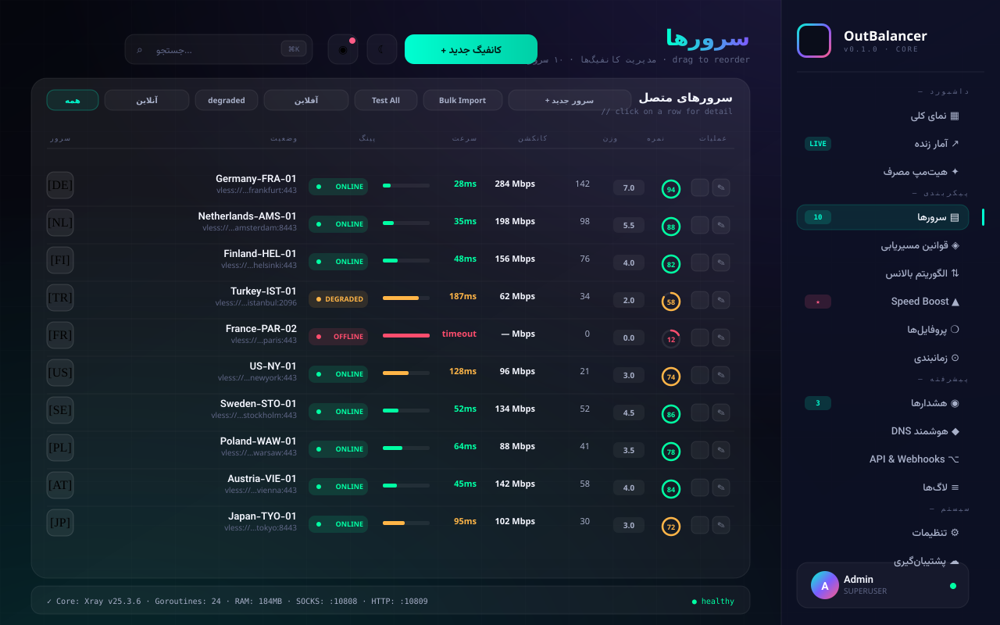
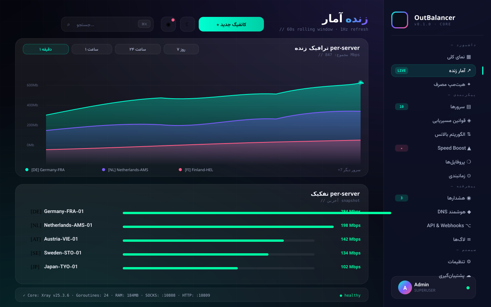
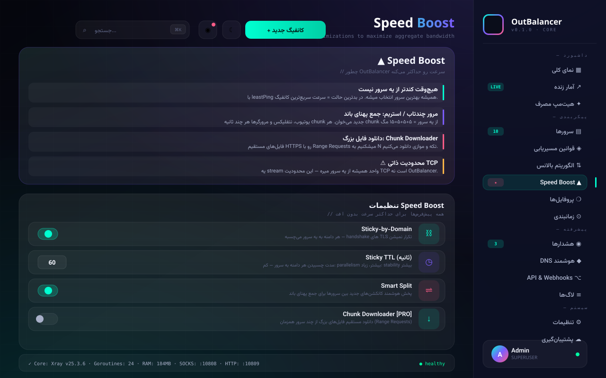
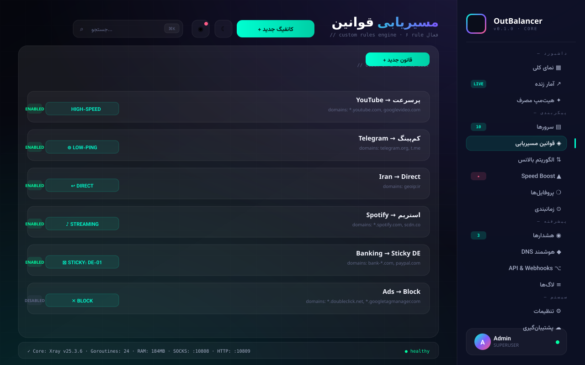
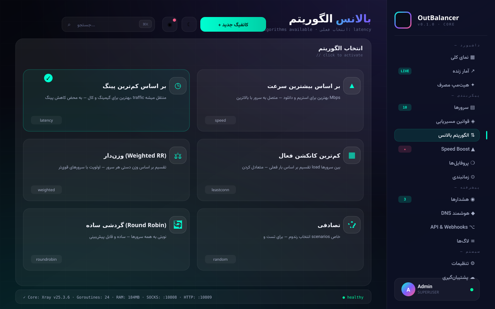
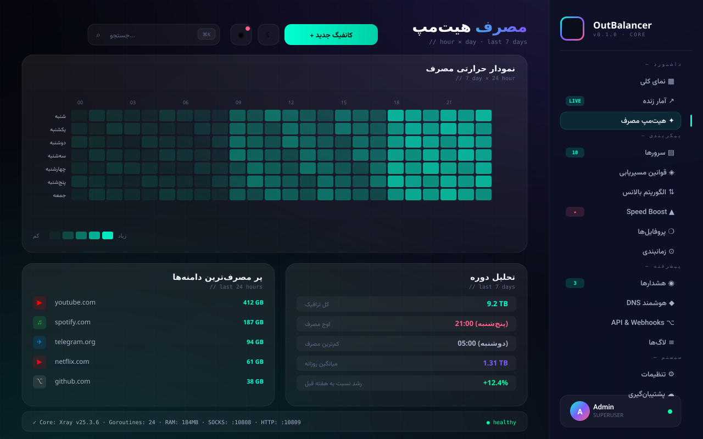
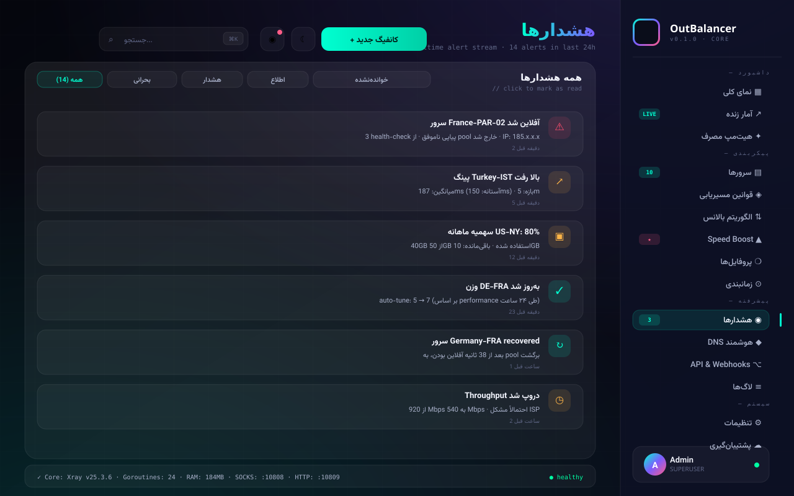
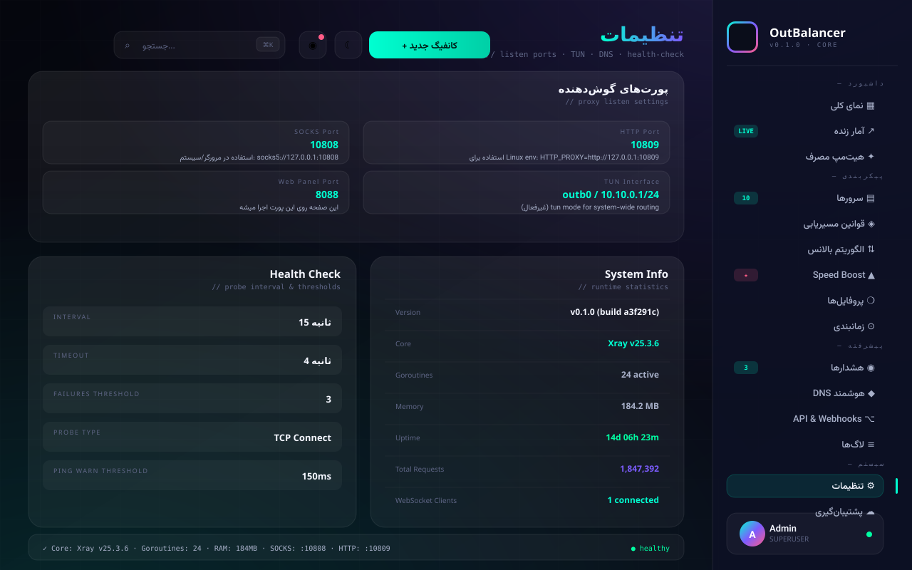
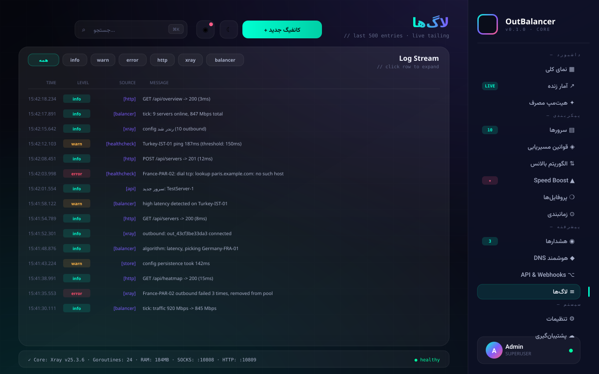

<div align="center">


# ⚡ OutBalancer

### پنل مدیریت Premium V2Ray Load Balancer
**Single-binary · Embedded xray-core · Air-gap friendly · Glassmorphic UI**

[](LICENSE)
[](https://go.dev)
[](#installation)

</div>

---

## ✨ ویژگی‌ها

- 🎯 **یک فایل اجرایی واحد** — xray-core کاملاً داخل باینری embed شده. هیچ نصب جدایی، هیچ download.
- 🛡 **Air-gap friendly** — برای سرورهای ایران و محیط‌های بدون اینترنت بین‌المللی. هیچ CDN/Google Fonts/Font Awesome.
- 🚀 **Speed Boost** — Sticky-by-Domain، Smart Split، Chunk Downloader.
- ⚙ **پورت‌های قابل تغییر** — SOCKS، HTTP، و bind address همه از CLI flag یا UI قابل تنظیم.
- 📊 **بدون داده fake** — تا وقتی ترافیک واقعی از xray نخوره، صفر نشون می‌ده.
- 🎨 **UI شیشه‌ای** — فونت اختصاصی Arad-MediumDots2.

---

## 📸 تصاویر پنل



<details>
<summary><b>صفحات بیشتر</b></summary>











</details>

---

## 📥 نصب

### روی سرور Linux (مثل سرور ایران)

یک فایل اجرایی، هیچ وابستگی:

```bash
wget https://github.com/YOUR_USER/outbalancer/releases/latest/download/outbalancer-linux-amd64
chmod +x outbalancer-linux-amd64
./outbalancer-linux-amd64
```

برای ARM (Raspberry Pi، Oracle ARM، AWS Graviton):

```bash
wget https://github.com/YOUR_USER/outbalancer/releases/latest/download/outbalancer-linux-arm64
chmod +x outbalancer-linux-arm64
./outbalancer-linux-arm64
```

سپس مرورگر: `http://YOUR_SERVER_IP:8088`

### Windows

```powershell
# دانلود outbalancer-windows-amd64.exe از Releases
.\outbalancer-windows-amd64.exe
```

### حالت دمو (بدون نیاز به کانفیگ واقعی)

```bash
./outbalancer-linux-amd64 --demo
```

---

## ⚙ پورت‌های قابل تنظیم

پورت‌های پیش‌فرض:
- پنل وب: **8088**
- SOCKS5 پروکسی: **10808**
- HTTP پروکسی: **10809**

### تغییر از CLI

```bash
./outbalancer-linux-amd64 --port 9000 --socks 11080 --http 11081
```

### اشتراک‌گذاری روی LAN

```bash
./outbalancer-linux-amd64 --listen 0.0.0.0
```

این پروکسی‌ها رو روی همه interface ها bind می‌کنه (دستگاه‌های دیگه LAN می‌تونن وصل بشن).

### تغییر از UI

تب **تنظیمات** → سه فیلد: HTTP Port، SOCKS Port، Bind Address. ذخیره کن، خود hesته restart می‌شه.

---

## 🔌 اتصال کلاینت

```bash
# لینوکس - متغیر محیطی
export http_proxy=http://127.0.0.1:10809
export https_proxy=http://127.0.0.1:10809

# تست
curl https://www.google.com
```

برای مرورگر: `socks5://127.0.0.1:10808`

---

## ⚡ Speed Boost: چطور سرعت بالا می‌ره؟

سه لایه بهینه‌سازی:

| سناریو | تکنیک | نتیجه |
|--------|------|------|
| یک stream / Zoom call | leastPing | همیشه = سریع‌ترین کانفیگ |
| مرور چندتاب، استریم HLS | Smart Split | جمع پهنای باند ✓ |
| دانلود فایل بزرگ | Chunk Downloader | جمع پهنای باند ✓ |

**خلاصه:** ۱۰ کانفیگ ۵مگی → از ۵ تا ۵۰ مگ بسته به نوع ترافیک. هیچ‌وقت کندتر از یه کانفیگ تنها نیست.

---

## 🛠 ساخت Release خودکار با GitHub Actions

این پروژه با **workflow_dispatch** تنظیم شده:

1. به repo برو → تب **Actions**
2. workflow «Release» رو انتخاب کن  
3. **Run workflow** کلیک کن
4. version بزن (مثلاً `v0.1.0`)
5. صبر کن ~۳ دقیقه — release آماده میشه با ۵ پلتفرم

هر دانلود **یک فایل اجرایی واحد** هست که شامل xray-core فول هم میشه.

---

## 📄 License

MIT
